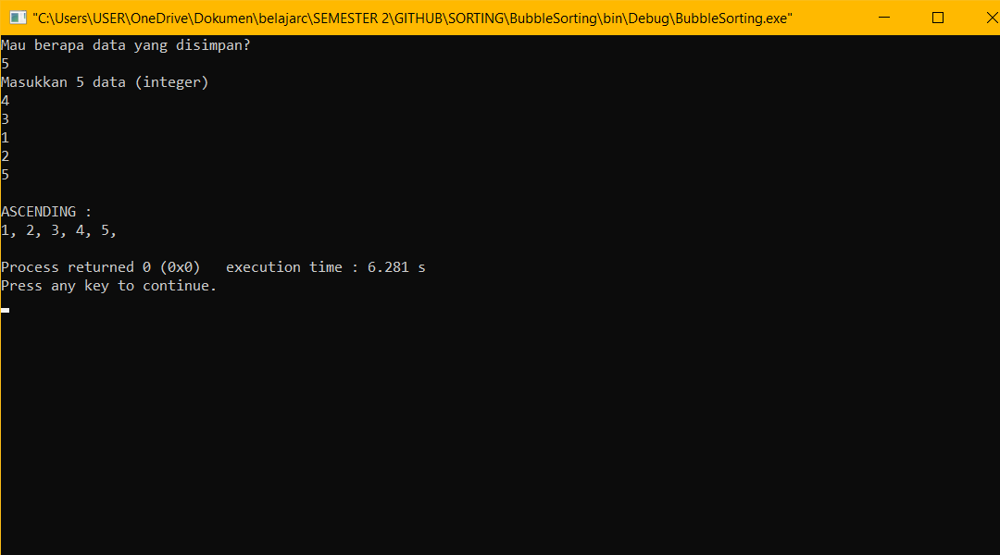
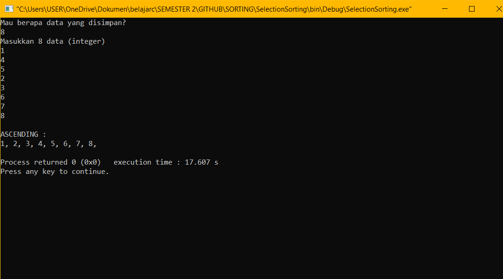
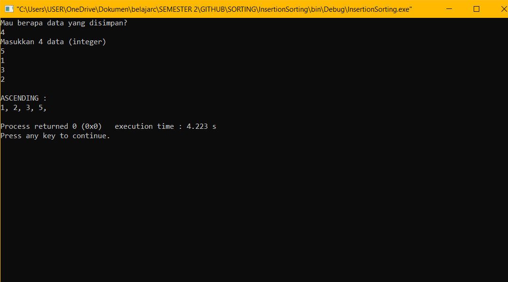

# SORTING

  Pengurutan (Sorting) adalah proses pengurutan data yang sebelumnya disusun secara acak sehingga tersusun secara teratur menurut aturan tertentu. Pengurutan dapat dilakukan         secara ascending (urut naik) dan descending (urut turun). Pengurutan data dalam struktur data sangat penting terutama untuk data yang bertipe data numerik ataupun karakter.
  
- <a href="https://github.com/RHW48/ASD/blob/main/SORTING/Code/BubbleSorting.c">Bubble Sorting</a>

  Bubble Sort adalah algoritme pengurutan sederhana yang berulang kali membandingkan elemen yang berdekatan dari array yang diberikan & menukarnya jika urutannya salah.

- <a href="https://github.com/RHW48/ASD/blob/main/SORTING/Code/SelectionSorting.c">Selection Sorting</a>

  Selection Sorting dapat didefinisikan sebagai algoritma lain untuk menyortir daftar di mana larik dipecah menjadi dua larik di mana larik pertama seharusnya kosong sedangkan       larik   kedua terdiri dari daftar nilai yang tidak disortir. Program mencari nilai terkecil pada larik kedua dan ketika nilai ditemukan, nilai tersebut telah dipindahkan ke awal   larik pertama yang kosong. Pendekatan ini diulangi lagi dan nilai terkecil berikutnya akan digeser ke indeks kedua dari array pertama. Proses akan terus berulang sampai array     kedua menjadi kosong.

- <a href="https://github.com/RHW48/ASD/blob/main/SORTING/Code/InsertionSorting.c">Insertion Sorting</a>

  Insertion sort adalah sebuah algoritma pengurutan yang membandingkan dua elemen data pertama, mengurutkannya, kemudian mengecek elemen data berikutnya satu persatu dan             membandingkannya dengan elemen data yang telah diurutkan. Metode Insertion Sort adalah proses pengurutan yang dimulai dari data ke-2 sampai dengan data ke- N, jika ditemukan       data  yang lebih kecil, maka akan ditempatkan (diinsert) diposisi yang seharusnya. 

